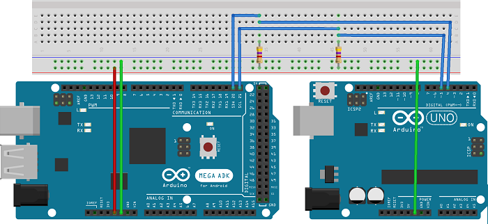

Due to Uno I2C connection
==============

This document describes how to connect an Arduino Due to an Arduino Uno for further I2C protocol communication.  

Since there was no Due in Fritzing I used a Mega which presents the same SDA and SCL pins.  

When hooking up Arduino boards that have SDA and SCL pins labelled, used these pins for I2C, otherwise, when no such labels exist, use pins 4 and 5.  

  

As per diagram, both boards use the same ground. The Mega/Due SDA pin connects to the Uno pin 4, while the SDL pin connects to Uno pin 5. Both lines have a 4.7k pullup resistor.  

Sketches can now be uploaded for each board to act as a master or slave, using the Wire library.  